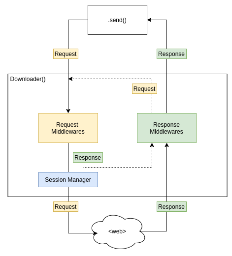

# Requestr

⚠ This is WIP - everything will change ⚠

Requestr is a web-scraping focused asynchronous http client manager based on `aiohttp`.  
Main goals of this package is to provide a http connection manager for web-scraping with sane defaults and ease of extension through middlewares:



Requestr is heavily relying on out/in middlewares which determine how to handle outgoing requests and incoming responses. 

Some other features:
- Batteries included for common web-scraping idioms like proxy/header rotation through `Request/Response Middlewares`
- Automatic multi-session handling through session pools through `Session Manager`
- Rate limiting for individual session, i.e. can limit foo.domain.com and bar.domain.com separately while connecting to both.


# Example

Single request
```python
from requestr import Download, Request

async with Downloader() as dl:
    resp = await dl.send(Request("http://httpbin.org/html"))
    print(resp.text)
```

Concurrent requests:
```python
from requestr import Download, Request
import asyncio

async with Downloader() as dl:
    # 10 different pages concurrently
    for resp in asyncio.as_completed([dl.send(Request(f"http://httpbin.org/links/10/{i}") for i range(10))]):
        print(await resp)
```

Multi session requests:
```python
from requestr import Download, Request

async with Downloader() as dl:
    resp = await dl.send(Request("http://httpbin.org/cookies/set/my_cookie/value", slot="foo"))
    resp = await dl.send(Request("http://httpbin.org/cookies", slot="foo"))
    print(resp.text)  # <= {"cookies": {"my_cookie": "value"}}
    resp = await dl.send(Request("http://httpbin.org/cookies", slot="bar"))
    print(resp.text)  # <= {"cookies": {}}  
```

See [/example/ directory for more](/example/)